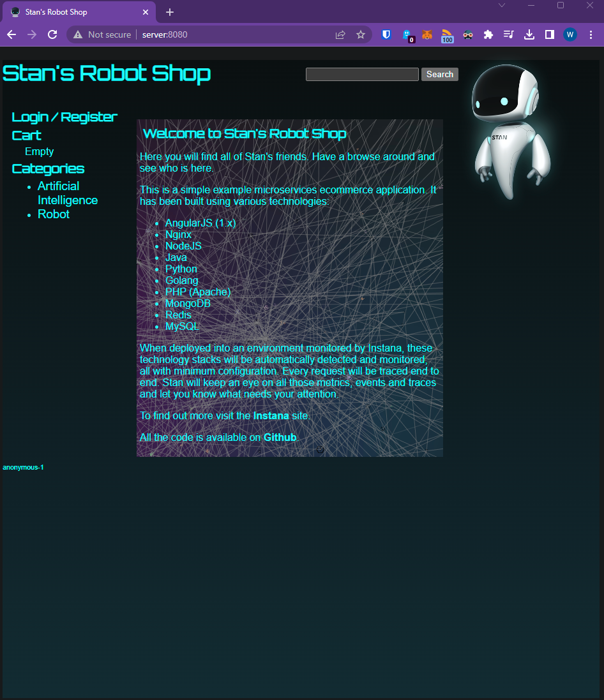
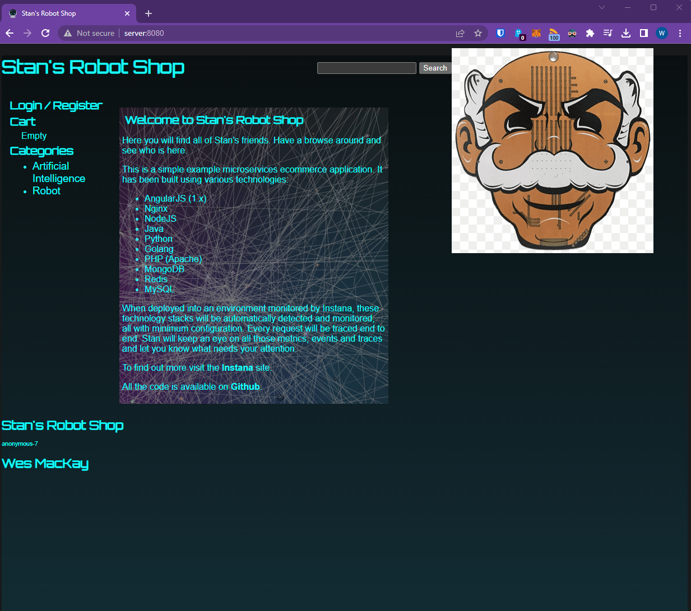

1. Change terminal directory into repo master folder
cd robot-shop/

2. Using the docker compose file, download and run the containers on the host
docker-compose pull
docker-compose up -d

3. Open a webpage with the port 8080 to access the homepage website
open "server:8080" or "192.168.3.22:8080"

4. Is there anything wrong with committing the file directly to the master branch? ...
- merging changes directly to the master branch could potentially  break/misconfigure the application.  The master branch should be the golden image that is trusted for deployments which would cause issues with anyone trying to deploy the app.
- I would prevent it by going to Github Repo -> Settings -> Branches -> Branch Protection Rules and add a rule stating "Require a pull request before merging".

